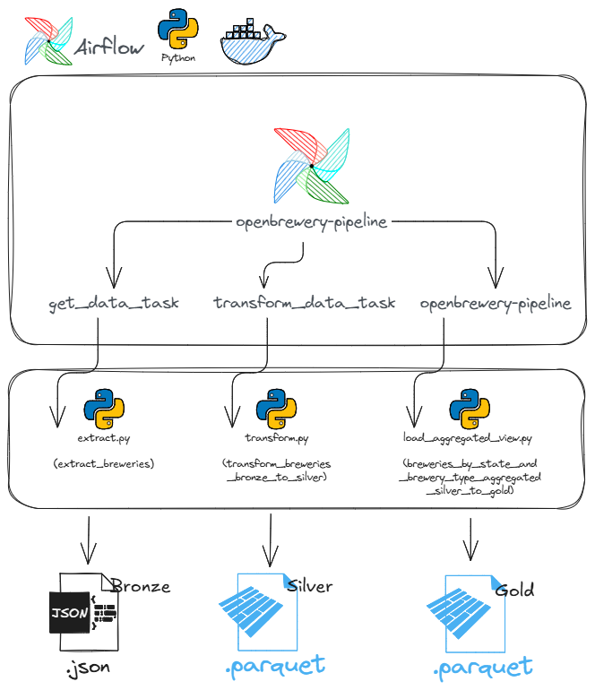
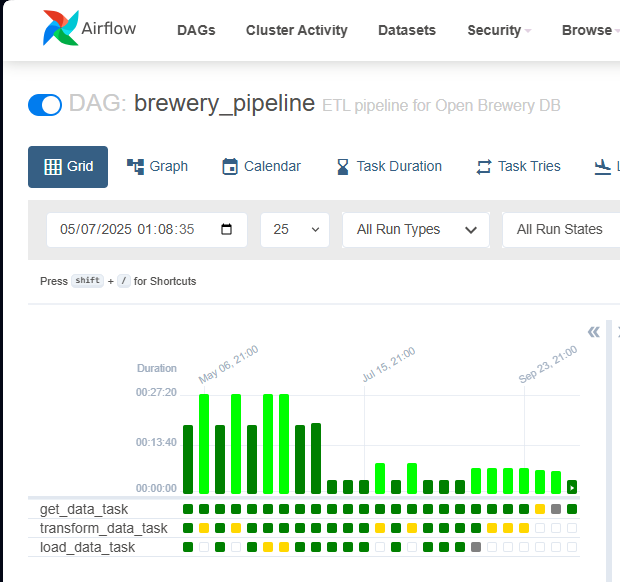
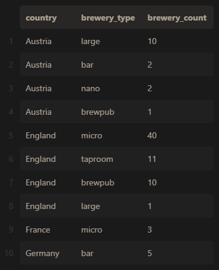

# OpenBrewery Data Pipeline




This project is a data pipeline built to consume data from the public API [Open Brewery DB](https://www.openbrewerydb.org/), applying the **Medallion Architecture** (Bronze, Silver, Gold) with data extraction, transformation, and aggregation. The pipeline is orchestrated using **Apache Airflow** and fully containerized with **Docker**.

## Objective

To demonstrate data engineering skills, including API integration, orchestration, transformation, layered data modeling (Medallion architecture).

## Technologies Used

- [Python 3.9+](https://www.python.org/)
- [Apache Airflow 2.8+](https://airflow.apache.org/)
- [Docker + Docker Compose](https://www.docker.com/)
- [Pandas](https://pandas.pydata.org/)
- [PyArrow](https://arrow.apache.org/)
- [Parquet](https://parquet.apache.org/)
- [Pytest](https://docs.pytest.org/)
- [OpenBrewery DB API](https://www.openbrewerydb.org/)


## Architecture Overview

```markdown
data/
├── bronze/ # Raw data extracted from the API (JSON)
├── silver/ # Cleaned and partitioned data (Parquet)
└── gold/ # Data for analysis grouped by country and state (Parquet)
```

## Project Folders Structure

```markdown
openbrewery-data-pipeline/
├── dags/ # Airflow DAGs
├── scripts/ # Python scripts (ETL)
│ ├── extract.py # API data extraction
│ ├── transform.py # Data cleaning and processing
│ └── load_aggregated_view.py # Aggregation (Gold Layer)
├── tests/ # Unit tests
├── data/ # Bronze / Silver / Gold layers
├── docker-compose.yaml # Airflow + Docker configuration
├── .env # Environment variables
├── .gitignore # Ignore patterns
├── requirements.txt # Python dependencies
└── README.md # Project documentation
```

## Docker Build 


### 1. Prerequisites

- Docker and Docker Compose installed
- Python 3.9+ (optional for running tests locally)
- Clone this repository to get docker-compose.yaml

```bash
git clone https://github.com/your-user/openbrewery-data-pipeline.git
cd openbrewery-data-pipeline
```

### 2. Start the Airflow Environment

```bash
# Compose docker services
docker compose up airflow-init

# Start the services
docker-compose up -d

# Stop the services
docker-compose down

# Check docker services health - Note only try to localhost:8080 when all servies are health and running! This may take a while.
docker ps
```

Make sure that docker is running before run the docker commands.

Access Airflow at http://localhost:8080

Default credentials:
- Username: airflow
- Password: airflow

You will see this dag: 


## Tests

#### (Optional) Create a virtual environment
```bash
python -m venv .venv
source .venv/bin/activate  # or .venv\Scripts\activate on Windows
```
#### Install dependencies
```bash
pip install -r requirements.txt
```
#### Run tests
```bash
python -m pytest
```

## Airflow DAG

The pipeline brewery_pipeline contains three steps:
- Extract: Fetches paginated brewery data from the API and saves it as JSON (Bronze).
- Transform: Cleans and standardizes the data, saving it as partitioned Parquet files by country and state (Silver).
- Load (Gold): Aggregates brewery counts by country and type, storing it in the Gold layer.

## Sample Output (Gold)
Aggregated data: number of breweries by country and type (data/gold/breweries_grouped_by_country.parquet)


## Running Locally Without Airflow (Optional)
Although the project is built to run with Apache Airflow + Docker, you can manually run the ETL pipeline locally (without Airflow) for testing purposes:

```bash
# 1. Extract raw data from the API (Bronze Layer)
python scripts/extract.py

# 2. Transform raw data and save Parquet files partitioned by country/state (Silver Layer)
python scripts/transform.py

# 3. Aggregate data to create analytics view (Gold Layer)
python scripts/load_aggregated_view.py

```

----
###### References
- [Python Docs – Logging HOWTO](https://docs.python.org/3/howto/logging.html)  
- [Pytest Documentation – Getting Started](https://docs.pytest.org/en/stable/getting-started.html)  
- [Stack Overflow – How do I list all files of a directory?](https://stackoverflow.com/questions/3207219/how-do-i-list-all-files-of-a-directory)  
- [Stack Overflow – How to get the latest file in a folder](https://stackoverflow.com/questions/39327032/how-to-get-the-latest-file-in-a-folder)  
- [Stack Overflow – Replacing pandas or numpy NaN with None](https://stackoverflow.com/questions/14162723/replacing-pandas-or-numpy-nan-with-a-none-to-use-with-mysqldb)  
- [Apache Arrow Documentation – Parquet I/O in Python](https://arrow.apache.org/docs/python/parquet.html)  
- [YouTube – Apache Airflow para Iniciantes (PT-BR)](https://www.youtube.com/watch?v=5NA57Pfpdr4)


